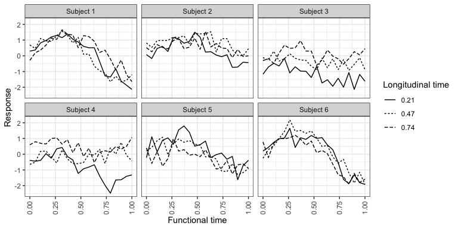
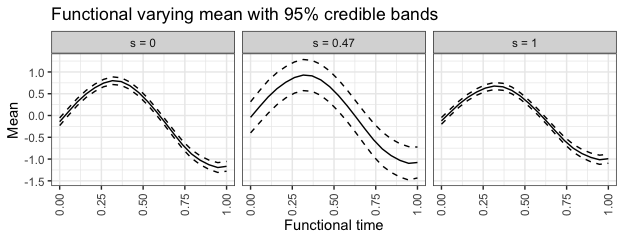
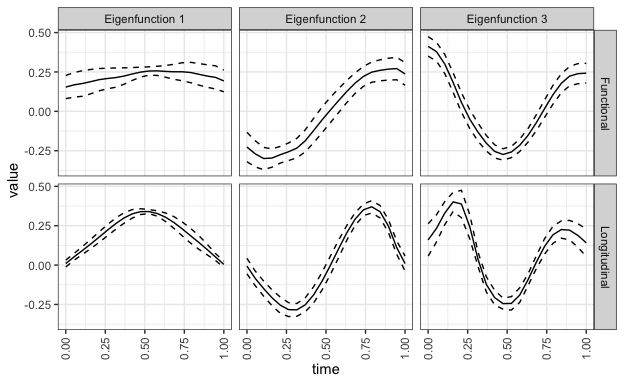

# Introduction
Longitudinal functional data is correlated functional data repeatedly observed over longitudinal time. We adopt a weak-separability approach to account for the within function and between function covariation. This approach allows for estimation of interpretable marginal covariance operators and time-varying functional means. In this example we simulate longitudinal functional data for 60 subjects with 20 within-function time points and 20 longitudinal points. We display some example curves of the raw data, estimate time-varying means with 95% simultaneous credible bands, and estimate marginal eigenfunctions with 95% simultaneous credible bands. Please see our Biostatistics manuscript "Bayesian analysis of longitudinal and multidimensional functional data" by Shamshoian et al. (2020) for more information. This notebook provides a minimally working example demonstrating the proposed methodology.


```r
library(tidyverse)
library(MASS)
library(Rcpp)
library(splines)
library(LFBayes)
library(plotly)
```

Users are required to construct their own basis functions for longitudinal and functional dimensions. 

```r
### Control parameters

set.seed(999)
source("/Users/johnshamshoian/Documents/R_projects/LFBayes/Example/Simulation_funcs.R")
errorvar <- .025
SS <- 20
TT <- 20
t <- seq(from = 0, to = 1, length.out = TT)
s <- seq(from = 0, to = 1, length.out = SS)
n <- 60
tt <- list()
tt[[1]] <- 1:(TT*SS)
tt <- rep(tt, n)
p1 <- 12
p2 <- 12
q1 <- 3
q2 <- 3
Bt <- bs(t, df = p1, intercept = TRUE)
Bs <- bs(s, df = p2, intercept = TRUE)
Bt1 <- bs(t, df = p1, intercept = TRUE)
Bs1 <- bs(s, df = p2, intercept = TRUE)
```


```r
### Generate key model quantities

H <- GenerateH(q1, q2)
mu1 <- GenerateMu1(s,t)
Lambda <- Loading.Matern(t, p1, q1, Bt)
Gamma <- Loading.Brown.Bridge(s, p2, q2)
Cov <- kronecker(Bs%*%Gamma, Bt%*%Lambda)%*%H%*%
  t(kronecker(Bs%*%Gamma, Bt%*%Lambda)) + errorvar * diag(SS * TT)
```

The time-varying mean is allowed to vary with covariates. In this example we do not include covariates so we only have an intercept term.

```r
### Generate data from model
x <- mvrnorm(n, mu  = as.vector(mu1), Sigma = Cov)
sx <- sd(x)
mx <- mean(x)
x <- (x-mx)/sx
Smooth_scaled_cov <- (Cov - errorvar * diag(SS * TT)) / sx^2
mu <- (mu1 - mx)/sx
y <- lapply(1:n, function(i) x[i,])
missing <- list()
for(ii in 1:n){
  missing[[ii]] <- numeric(0)
}
X <- cbind(rep(1, n))
```

We plot the first 6 subjects functional response data over several longitudinal times.

```r
### Visualize a few trajectories

nsub <- 6
small_data <- tibble(id = numeric(),
                     func_time = numeric(),
                     long_time = numeric(),
                     value = numeric())
small_data <- small_data %>% 
  add_row(id = rep(1:nsub, each = SS * TT),
          func_time = rep(rep(t, SS), nsub),
          long_time = rep(rep(s, each = TT), nsub),
          value = c(t(x[1:nsub,])))

id.labs <- paste("Subject", 1:nsub)
names(id.labs) <- "1":nsub
small_data %>%
  filter(long_time %in% c(s[5], s[10], s[15])) %>%
  ggplot(aes(func_time, value)) +
  geom_line(aes(linetype = factor(long_time))) +
  facet_wrap(. ~ id, labeller = labeller(id = id.labs)) + 
  theme_bw() +
  theme(axis.text.x = element_text(angle = 90, vjust = 0.5, hjust=1)) + 
  labs(x = "Functional time", y = "Response", linetype = "Longitudinal time") +
  scale_linetype_discrete(labels = round(c(s[5], s[10], s[15]), 2))
```

<!-- -->

```r
### MCMC control parameters

iter <- 10000 # Number of iterations
burnin <- 5000 # Burnin iterations
thin <- 5 # Thinning for each chain
nchain <- 1 # Number of chains
q1s <- 3 # Number of latent factors for functional dimension
q2s <- 3 # Number of latent factors for longitudinal dimension
alpha <- .05 # Type 1 error
neig <- 3 # Number of eigenfunctions for inference
```


```r
### Processing
posterior_samples <- run_mcmc(y, missing, X, Bs1, Bt1,
                       q1s, q2s, iter, thin, burnin, nchain)
posterior_summaries <- get_posterior_summaries(Bs1, Bt1, posterior_samples, neig,
                            iter, burnin, nchain, s, t, alpha)
```


```r
### Prepare data for plotting
mean_tibble <- tibble(func_time = rep(t, SS * 3), long_time = rep(rep(s, each = TT), 3),
                      value =   c(posterior_summaries$lower, posterior_summaries$postmean, posterior_summaries$upper),
                      bound = rep(c("lower", "mean", "upper"), each = SS * TT))
postmean <- matrix(posterior_summaries$postmean, nrow = TT, ncol = SS)
fig <- plot_ly(z = ~postmean, x = s, y = t) %>% add_surface()
eigenfunction_tibble <- tibble(time = numeric(), type = character(),
                               value = numeric(), bound = character(),
                               number = numeric())
eigenfunction_tibble <- eigenfunction_tibble %>%
  add_row(value = c(posterior_summaries$eigvecFuncmean,
                    posterior_summaries$eigvecFunclower,
                    posterior_summaries$eigvecFuncupper),
          number = rep(rep(1:neig, each = TT), 3),
          bound = rep(c("mean", "lower", "upper"), each = neig * TT),
          type = "Functional",
          time = rep(t, 3 * neig)) %>%
  add_row(value = c(posterior_summaries$eigvecLongmean,
                    posterior_summaries$eigvecLonglower,
                    posterior_summaries$eigvecLongupper),
          number = rep(rep(1:neig, each = SS), 3),
          bound = rep(c("mean", "lower", "upper"), each = neig * SS),
          type = "Longitudinal",
          time = rep(s, 3 * neig))
```


```r
# Plot time-varying means
long.labs <- paste("s =", round(c(s[1], s[10], s[20]), 2))
names(long.labs) <- c(s[1], s[10], s[20])
mean_tibble %>%
  filter(long_time %in% c(s[1], s[10], s[20])) %>%
  ggplot(aes(func_time, value)) +
  geom_line(aes(linetype = bound)) +
  facet_wrap(~ long_time, labeller = labeller(long_time = long.labs)) +
  scale_linetype_manual(values=c("dashed", "solid", "dashed")) +
  labs(x = "Functional time", y ="Mean", title = "Functional varying mean with 95% credible bands") +
  theme_bw() + 
  theme(legend.position = "none",
        axis.text.x = element_text(angle = 90, vjust = 0.5, hjust=1))
```

<!-- -->


```r
### Plot marginal functional and longitudinal eigenfunctions
number.labs <- paste("Eigenfunction", 1:neig)
names(number.labs) <- c("1":neig)
eigenfunction_tibble %>%
  ggplot(aes(time, value)) +
  geom_line(aes(linetype = bound)) +
  facet_grid(type ~ number, labeller = labeller(number = number.labs)) +
  scale_linetype_manual(values=c("dashed", "solid", "dashed")) +
  theme_bw() +
  theme(legend.position = "none",
        axis.text.x = element_text(angle = 90, vjust = 0.5, hjust=1))
```

<!-- -->


```r
### Percent variability explained by first few eigenfunctions in functional direction
100 * rowMeans(posterior_summaries$eigvalFunc)[p1:(p1-neig+1)]
```

```
## [1] 64.978228 24.021164  6.376728
```


```r
### Percent variability explained by first few eigenfunctions in longitudinal direction
100 * rowMeans(posterior_summaries$eigvalLong)[p2:(p2-neig+1)]
```

```
## [1] 78.179720 15.376497  2.516821
```
